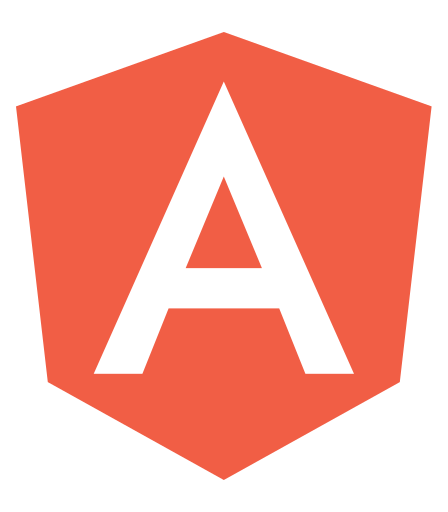
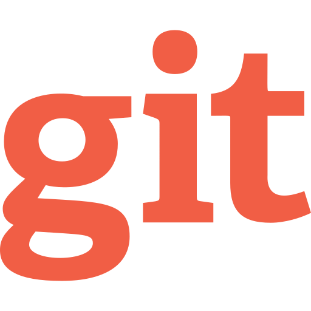

Frontend Developer with some knowledge of Backend Development using NodeJS and MySQL. I originally studied User Interaction Design and then started pursing web development development. 

**Website**: https://manuelosogithub.io
**LinkedIn**: https://linkedin.com/manuel-osorio
**Twitter**: https://twitter.com/theManuelOsorio

## Tools

## Languages

