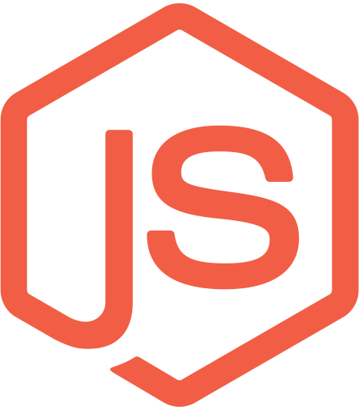
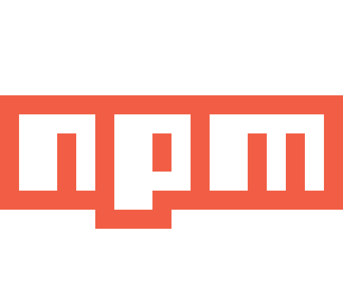
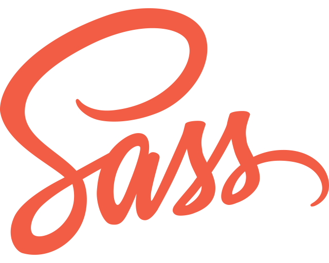
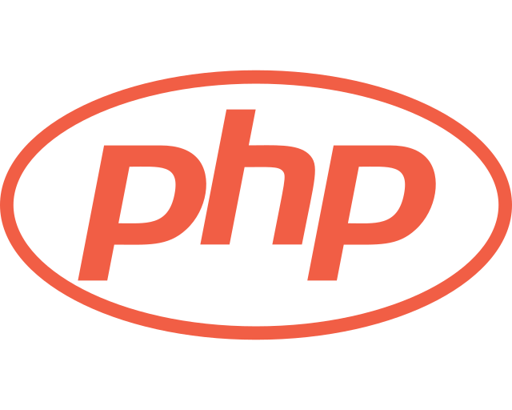

Hi, I’m Manuel Osorio—a Fullstack JavaScript Developer with a solid foundation in Graphic Design. My journey in web development is driven by a focus on creating seamless, user-centered experiences. I work across the entire stack, using front-end frameworks like Angular and React, as well as back-end technologies like Node.js and PHP, to build robust applications. My expertise extends to database management with systems like MySQL, PostgreSQL, and MongoDB, ensuring data is handled efficiently.

In addition to coding, I have a strong eye for design, utilizing tools like Figma, Adobe XD, and Photoshop to create intuitive and visually appealing interfaces. Whether it’s optimizing for SEO, implementing mobile-first designs, or managing complex projects with Git and Webpack, I bring a well-rounded skill set to every project.

**Website**: https://manuelosorio.me

**LinkedIn**: https://www.linkedin.com/in/manuel-osorio/

**Twitter**: https://twitter.com/theManuelOsorio

<a href='https://manuelosorio.github.io/resume.pdf' target="_blank">Resume</a>

## Tools
&nbsp;&nbsp;&nbsp;&nbsp;&nbsp;&nbsp;&nbsp;&nbsp;&nbsp;&nbsp;&nbsp;&nbsp;&nbsp;&nbsp;&nbsp;&nbsp;&nbsp;&nbsp;

## Languages

&nbsp;&nbsp;&nbsp;&nbsp;&nbsp;&nbsp;&nbsp;&nbsp;&nbsp;&nbsp;&nbsp;&nbsp;

##  

